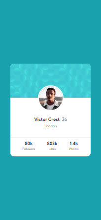
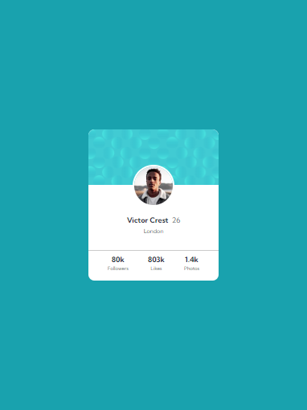
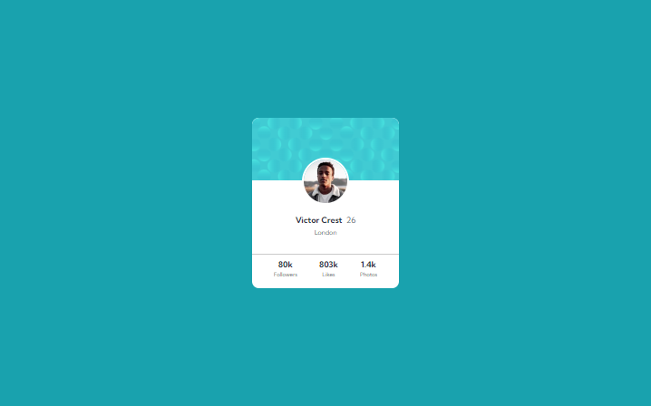

# Frontend Mentor - Profile card component solution

Esta é uma solução para o [Profile card component challenge on Frontend Mentor](https://www.frontendmentor.io/challenges/profile-card-component-cfArpWshJ). Os desafios do Frontend Mentor ajudam você a melhorar suas habilidades de codificação criando projetos realistas.

## Table of contents

- [Visão geral](#overview)
  - [O desafio](#the-challenge)
  - [Screenshot](#screenshot)
    - [Mobile](#mobile)
    - [Desktop](#desktop)
  - [Links](#links)
- [Meu processo](#my-process)
  - [Construído com](#built-with)
- [Autor](#Autor)

## Visão geral

### O desafio

- Construa o projeto de acordo com os designs fornecidos

### Screenshot

#### Mobile

#### Desktop

### Links

- URL da Solução: [https://www.frontendmentor.io/solutions/profile-card-component](https://www.frontendmentor.io/solutions/profile-card-component)
- Live Site URL: [https://.github.io/profile-card-component/](https:/.github.io/profile-card-component/)
- URL do código no GitHub: [https://.github.io/profile-card-component/](https:/.github.io/profile-card-component/)

## Meu processo

### Construído com

- HTML5 semântico
- Propriedades personalizadas do CSS
- Flexbox
- Fluxo de trabalho pensando no mobile primeiro

## Autor

 <b>Pedro Henrique Aquino

Feito com ❤️ por Pedro Henrique Aquino 👋🏽 Entre em contato!

- GitHub - [Pedro Aquino](https://github.com/phasa15)
- Frontend Mentor - [@phasa15](https://www.frontendmentor.io/profile/phasa15)

  

